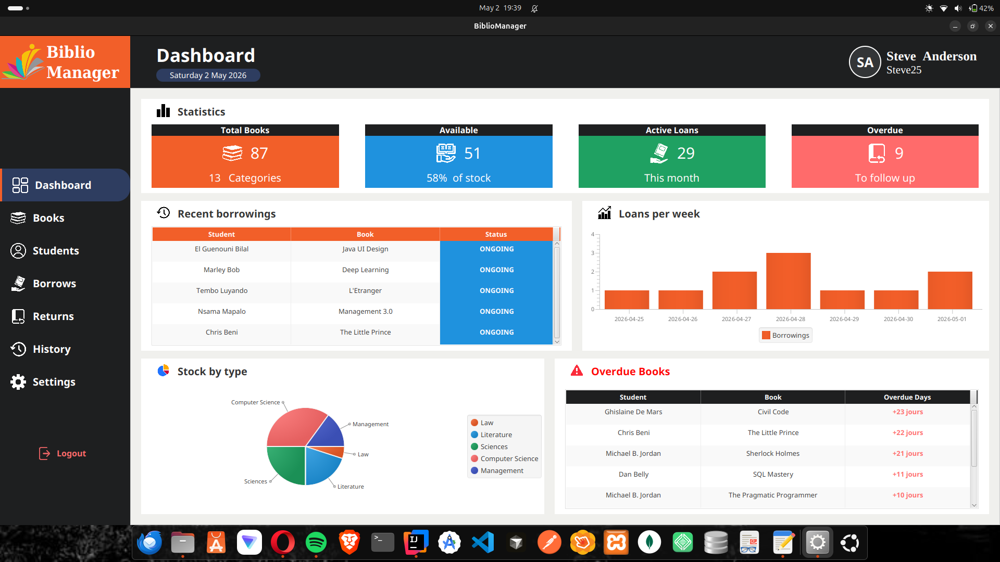
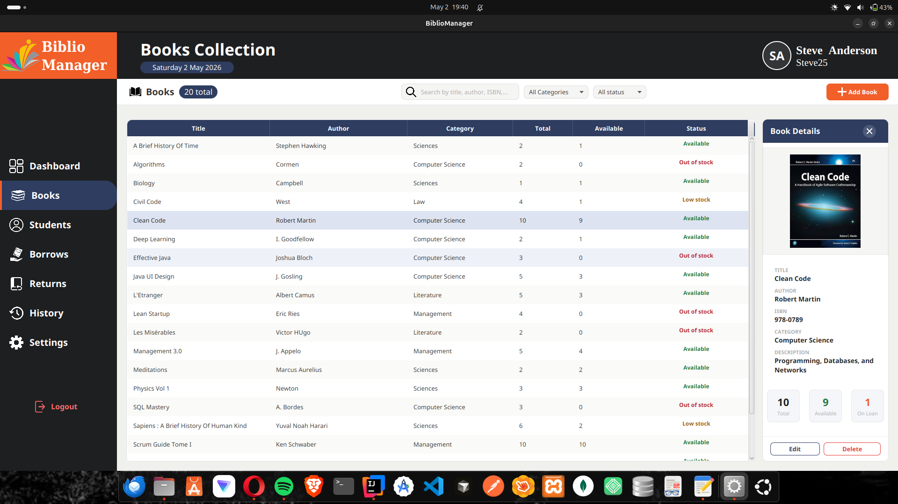
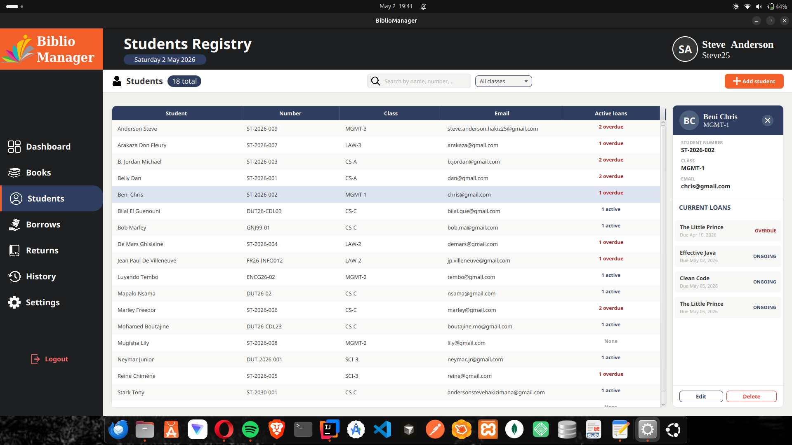
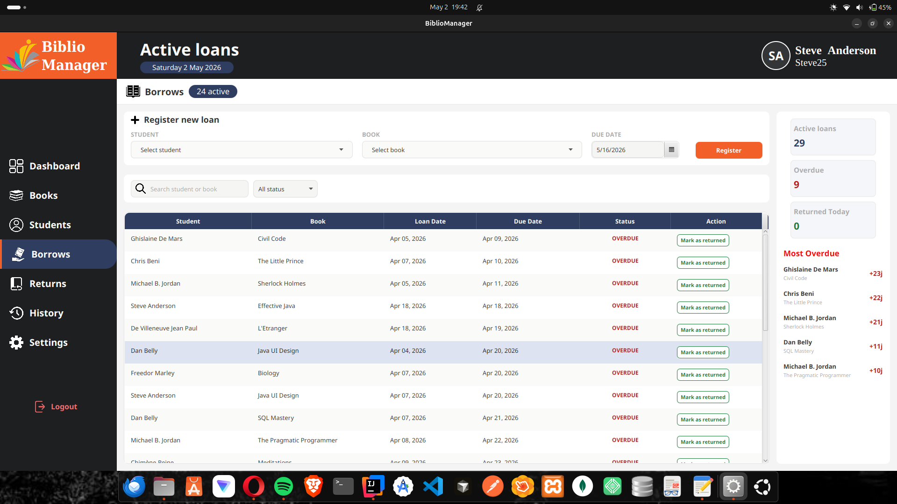
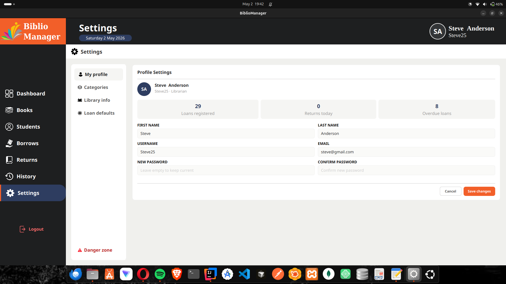

<div align="center">


# BiblioManager

**A desktop library management system for educational institutions**

[](https://www.oracle.com/java/)
[](https://openjfx.io/)
[](https://www.sqlite.org/)
[](https://maven.apache.org/)
[](LICENSE)

*Java Course Project - ESTD, Université Ibn Zohr, Dakhla, Morocco - 2025/2026*

</div>

---

## Overview

BiblioManager is a full-featured JavaFX desktop application designed to manage a school library. It allows librarians to manage books, students, loans and returns, with a clean UI, real-time statistics and PDF/CSV export.

---

## App preview

### Dashboard


### Books Collection


### Students Registry


### Active Borrows


### Settings


---

## Features

### 📚 Books Management
- Add, edit and delete books with optional cover image
- Filter by category and availability status (Available / Low stock / Out of stock)
- Real-time availability tracking - total / available / on loan
- Slide-in detail panel with stock cards

### 🎓 Students Registry
- Full CRUD for student profiles with class and contact info
- Active loans displayed directly in the detail panel
- Search by name or student number, filter by class

### 📋 Loan Management
- Register loans with student + book + due date selection
- Book availability decrements automatically on loan creation
- Real-time sidebar stats: active loans, overdue count, returned today
- Mark as returned in one click - availability restored automatically

### 🔄 Returns Tracking
- History of all returned books with on-time / late status
- Filter by period (today / week / month) and return type
- Stats: punctuality rate, expected returns today, average overdue days
- Weekly returns chart built dynamically

### 📊 Activity History
- Full audit log - all loans regardless of status
- Filter by status, period and keyword
- **Export to CSV** for Excel analysis
- **Export to PDF** - formatted report, key stats and full activity table

### ⚙️ Settings
- Edit librarian profile (name, email, username, password)
- Manage book categories (add, rename, delete with book count)
- Configure library info and default loan duration / max loans per student
- Danger zone: reset loans only or full database wipe (double confirmation)

---

## Tech Stack

| Layer | Technology |
|---|---|
| Language | Java 21 |
| UI Framework | JavaFX 21.0.6 + FXML |
| Styling | JavaFX CSS (custom per view) |
| Database | SQLite 3 via xerial/sqlite-jdbc 3.45 |
| PDF Export | iText 7.2.5 |
| Build Tool | Apache Maven |
| UI Design | Scene Builder |
| IDE | IntelliJ IDEA |

**Architecture:** MVC - Models / Repositories / Services / Controllers

---

## Project Structure

```
src/main/
├── java/com/bibliomanager/
│   ├── controller/          # One controller per FXML view
│   ├── model/               # Domain models (Book, Student, Loan, Librarian…)
│   ├── repository/          # SQL access layer (JDBC + SQLite)
│   ├── service/             # Business logic, validation, PDF/CSV export
│   └── utils/               # DatabaseManager, UserSession, DateUtils
└── resources/com/bibliomanager/
    ├── css/                 # Stylesheets (books.css, settings.css…)
    ├── fxml/                # Layouts (one per view)
    └── icons/               # PNG icons used across the app
```

---

## Getting Started

### Prerequisites

- Java 21+
- Maven 3.x

### Run

```bash
git clone https://github.com/SteveAnderson95/BiblioManager.git
cd BiblioManager
mvn clean javafx:run
```

### First Login

The database is created automatically on first launch.

```
Username : Steve25
Password : steve123
```

---

## Database Schema

```
librarians  → id, first_name, last_name, email, username, password
categories  → id, name, description
students    → id, student_number, first_name, last_name, school_class, email
books       → id, title, author, isbn, category_id, cover_image,
              total_quantity, available_quantity
loans       → id, student_id, book_id, registered_by,
              loan_date, due_date, return_date, status
```
See : src/main/resources/com/bibliomanager/db/library.sql

---

## Author

**Steve Anderson H.**  
[LinkedIn](www.linkedin.com/in/steve-anderson-hakizimana) 

---

⭐ Feel free to leave a star if you liked this project!